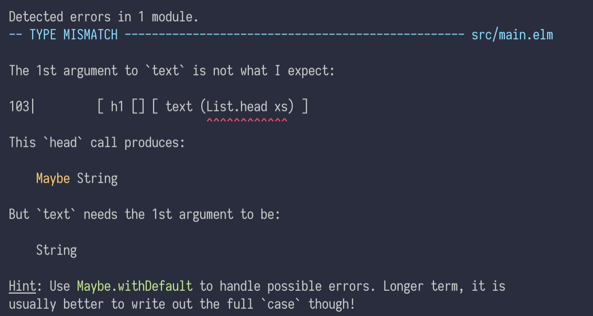

import { syntaxHighlighterPrism } from '@mdx-deck/themes'
import { future } from '@mdx-deck/themes'
import { Appear } from '@mdx-deck/components'
import { FullScreenCode } from '@mdx-deck/layouts'

export const themes = [ future, syntaxHighlighterPrism ]


# Hello, Elm!


---

## What is Elm?

---

_Elm is a statically typed functional language that compiles to JavaScript, focusing on building frontend application._

---

## How does it looks like?

---

this is javascript

```js
const add = (a, b) => a + b
```

---

this is elm

```elm
add a b = a + b
```

---

### But.. where is type?

---

### type inference ftw!

---

```elm
add : number -> number -> number
add a b = a + b
```


---
```elm
add 1 2 -- 3 : number
```
---

what does

`->`

mean

---

why not..

```elm
add : (number, number) -> number
```

but

```elm
add : number -> number -> number
```

?

---

```elm
add 1
-- <function> : number -> number
```

---

cuz


```elm
add : number -> number -> number
```

=

```elm
add : number -> (number -> number)
```

---

## Everything is expression

---

```elm
oneIsPositive =
    if 1 > 0 then
        "positive"

    else
        "not positive"
```

---

```elm
checkIfPositive n =
    if n > 0 then
        "positive"

    else
        "not positive"

oneIsPositive = checkIfPositive 1
```

---

## NULL / UNDEFINED / NaN

---

```js
const xs = []

xs[0]
```

---

```
❌ TypeError: undefined is not a function
```

---

```js
const numbers = []

numbers[0] * 10
```

---


---

```elm
List.head []
```

---

```elm
List.head []
-- Nothing : Maybe a
```

---

```elm
List.head ["hello", "world"]
-- Just "hello" : Maybe String
```

---

```elm
type Maybe a
    = Just a
    | Nothing
```

---

compiler that talks to you



---

## Elm Architechture

---

"The Elm Architecture is a simple pattern for architecting webapps. It is great for modularity, code reuse, and testing. Ultimately, it makes it easy to create complex web apps that stay healthy as you refactor and add features."

---

model / view / update

---

### Counter example (no pun intended)

<iframe style={{ backgroundColor: "white" }}
  src="http://localhost:8000/"
/>

---

And that's the intro.

Hopes that it generates interest and curiosity!
